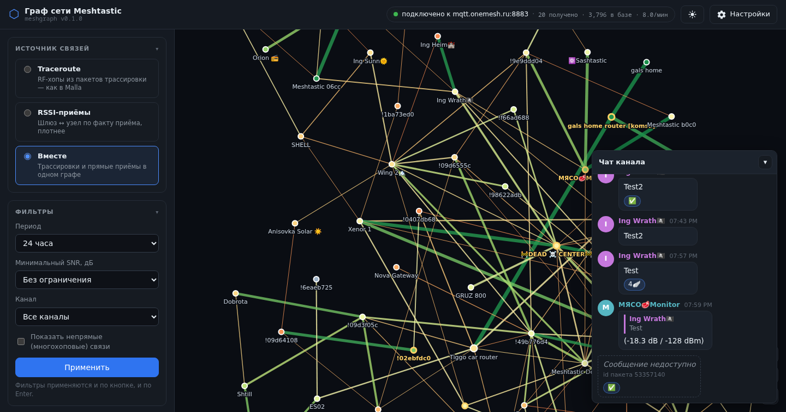
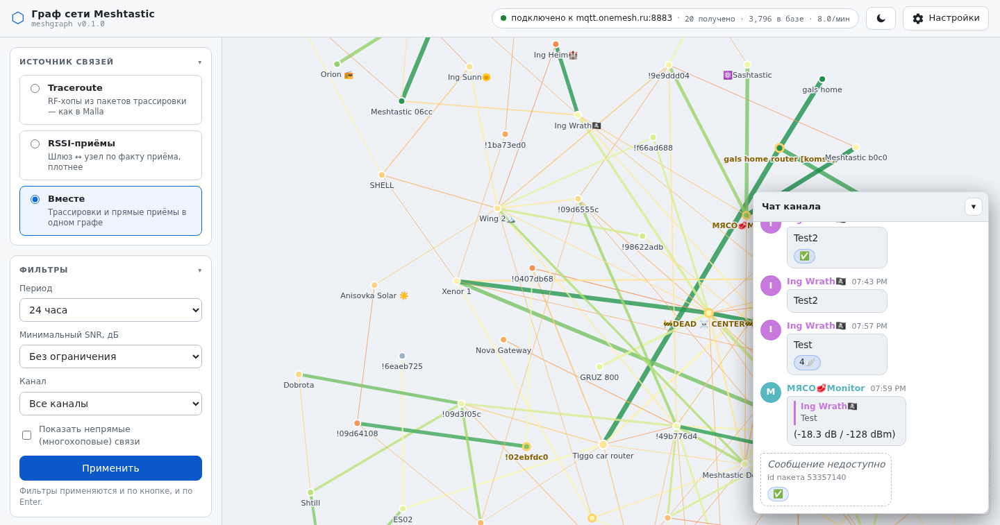

# meshgraph

Автономный граф сети Meshtastic: одна страница + кнопка настроек для подключения
к MQTT-брокеру. Это вырезанная из [Malla](https://github.com/zenitraM/malla)
«Network graph» без всего остального — без дашборда, пакетов, карты и аналитики.

Проект лицензирован по MIT, как и исходная Malla. Ключевые алгоритмы (расшифровка
каналов, разбор traceroute, построение графа, признаки достоверности RSSI/SNR)
перенесены оттуда и сохранены один в один.

## Скриншоты

Тёмная тема:



Светлая тема (та же страница, кнопка в шапке):



## Что внутри

```
MQTT-брокер ──► meshgraph (один процесс)
                  ├─ capture-поток: paho-mqtt → protobuf → AES-CTR → SQLite
                  └─ веб-интерфейс: страница графа + /api/graph + настройки
```

Один процесс = нажал «Сохранить» в настройках, и соединение с новым брокером
переустанавливается сразу, без перезапуска.

## Режимы графа

| Режим | Что показывает | Когда брать |
|---|---|---|
| **Traceroute** | RF-хопы из пакетов `TRACEROUTE_APP`, как в оригинальной Malla | Сети, где узлы реально шлют traceroute |
| **RSSI-приёмы** | Шлюз ↔ узел по факту прямого приёма (`hop_start == hop_limit`), с RSSI/SNR | Любая сеть: попадают **все** передающие узлы, а не только участники traceroute |
| **Вместе** | Оба графа в одном: узлы и связи объединяются | Нужна полная картина — и трассировки, и плотность приёмов |

Переключатель — в левом колонке. Режим по умолчанию задаётся в настройках.

В комбинированном режиме:

- пара узлов, замеченная обоими способами, рисуется **одной линией** с полем
  `modes` (`["traceroute", "rssi"]`); SNR берётся из трассировки, RSSI — из
  приёмов, толщина линии пересчитывается;
- счётчик «Связей» у узла — объединение соседей из обоих режимов, а не сумма
  (одни и те же пакеты участвуют в двух подграфах);
- подробности по каждому режиму лежат в API отдельно:
  `stats.traceroute` и `stats.rssi`.

> Граф **Traceroute** строится исключительно из traceroute-пакетов. Если в вашей
> сети их нет, он останется пустым — это не баг. Переключитесь на **RSSI-приёмы**
> или на **Вместе**.

### Острова

Несвязанные части сети не сваливаются в кучу по центру холста, а разъезжаются
по разным зонам: каждая связная часть (остров) получает свою ячейку с небольшим
зазором (20 px плановых; сами узлы и так держат ~100 px благодаря силе
коллизии) — отделённость видна, но части остаются рядом и на экране. Как только
между частями появляется связь — прямая или непрямая, — они сливаются в один
остров, и раскладка снова становится единой.

- счётчик **«Островов»** в панели статистики: > 1 подсвечивается жёлтым;
- упаковка перебирает несколько развёрток и выбирает ту, что ближе к форме
  экрана (частям хватает места, а зумить приходится меньше);
- вид сразу показывает место назначения (масштаб ≤ 1), поэтому части не
  уезжают за край экрана во время движения; после расчёта вид подгоняется
  ещё точнее — пока вы сами не сдвинули его;
- координаты MapReport на раскладку **не влияют вовсе**: одна ошибочная
  координата больше не может испортить вид — форма части целиком определяется
  связями, а координаты показываются в карточке узла («Координаты»);
- силы подогнаны под компактность: короткие связи (140–160 px) и слабое
  отталкивание (−110) — на том же экране 1200×650 части вдвое компактнее
  (масштаб подгонки ~0.5 против 0.29 прежде), минимум ~100 px белого
  по-прежнему держит коллизия;
- узлы не садятся на чужие линии связи: раньше часть узлов оказывалась точно
  на связи, к которой не относилась (визуально — «узел в этой связи»), теперь
  отталкивание от чужих сегментов держит до линии видимый зазор (свои две
  линии не считаются — концы связи касаются её намеренно).

Логика вынесена в чистый модуль `static/layout.js` и покрыта тестами через
QuickJS (`tests/test_layout_js.py`), включая интеграционный прогон на
настоящих силах d3.

### Обновление и вид

Данные обновляются автоматически раз в минуту (а также при смене фильтров и
ресайзе окна) — и обновление ничего не сбрасывает:

- координаты узлов и зум с панорамой переносятся из прошлого рендера: граф
  остаётся на месте, а перетаскиваемый узел не вырывается из-под курсора;
- пока вы тянете узел, перерисовка откладывается и выполняется сразу после
  того, как вы его отпустили;
- если структура сети не изменилась (те же связные части), не переупаковываются
  и ячейки островов, а авто-подгонка вида срабатывает только при первом показе —
  ваш жест зума ей не мешает, и она не перебивает ваш жест.

### Сворачивание разделов

Заголовок раздела в боковом меню — это кнопка: клик (или Enter /
Пробел) сворачивает и разворачивает раздел, шеврон справа показывает
состояние. Свёрнутость каждого раздела помнится в браузере отдельно —
при следующем открытии страницы меню будет таким, каким вы его оставили.
Сворачиваются все разделы, кроме компактных — «Поиск узла» и «Выделено»
(у них в разметке `data-nofold`, шеврона у них нет).

### Тема: тёмная и светлая

Кнопка с солнцем/луной в шапке переключает страницу между тёмной и светлой
темой — вместе с интерфейсом перекрашиваются канва графа, подписи узлов,
tooltip'ы и окно чата. Выбор запоминается в браузере и применяется ещё до
первой отрисовки страницы, поэтому при загрузке ничего не мигает. По
умолчанию страница следует системной настройке `prefers-color-scheme`, пока
вы сами не выберете тему кнопкой.

### Чат канала

Окно в правом нижнем углу показывает текстовые сообщения канала как в
мессенджере. Основано на полях внутреннего `Data`-протокола Meshtastic:

- **ответы** — пакеты с `reply_id` («intended to be a reply to a previously
  sent message with the defined id») рисуются цитатой с именем и текстом
  оригинала; клик по цитате подсвечивает и прокручивает к исходному
  сообщению (если оно выпало из базы — заглушка «сообщение недоступно»,
  клик по ней ведёт к фантому, если на недоступное сообщение есть
  реакции);
- **реакции** — пакет с `reply_id`, помеченный флагом `emoji` («payload
  should be treated as an emoji like giving a message a heart») или
  состоящий только из эмодзи, превращается в пилюлю под целевым
  сообщением: эмодзи и счётчик, имена реагирующих — во всплывающей
  подсказке; один узел, повторивший одну реакцию, считается один раз;
  если целевого сообщения в базе нет, все его реакции собираются на
  фантомную заглушку «Сообщение недоступно» (серый пунктирный пузырь с
  id пакета) — это не отдельные сообщения-ответы;
- **дедупликация** — одно сообщение слышат несколько шлюзов: приёмы
  схлопываются по (отправитель, id пакета), остаётся самый ранний приём;
- **пиксель-арт** — рисунки из пиксель-арта-прошивки едут тем же
  широковещанием на приватном порту `PRIVATE_APP` и попадают в чат как
  обычные сообщения: полезный груз распаковывается на сервере по
  спецификации (семь алгоритмов сжатия, от RAW до DELTA_2D), картинка
  рисуется на `canvas` целыми пикселями с палитрой самого пакета (24
  палитры) — цвета свои у каждой картинки и не зависят от темы страницы,
  а рамка вокруг них обычная, на CSS-переменных; ответ на картинку
  цитируется как «пиксель-арт WxH», чужой приватный трафик (MFT-файлообмен
  с магией `MFT\x01`) в чат не попадает;
- показываются только широковещательные сообщения — ЛС в чат не попадают;
- глубина окна следует за полем «Период» в сайдбаре (и за фильтром канала);
- окно **сворачивается** (в свёрнутом виде — счётчик непрочитанных) и
  **перетаскивается** за заголовок; положение, свёрнутость и отметка
  прочитанного хранятся в браузере, обновление — опрос раз в 10 секунд,
  пока вкладка активна.

Сообщения, пришедшие до этого обновления, хранятся без `reply_id`/`emoji`
(поля только что появились в схеме базы) — цитаты и реакции появляются для
новых сообщений.

## Установка одной строкой

```bash
curl -fsSL https://raw.githubusercontent.com/Sashoid-x/meshgraph/main/install.sh | bash
```

**Скрипт интерактивный** — он спрашивает каталог установки, порт веб-интерфейса,
интерфейс слушания (`0.0.0.0` — вся сеть, `127.0.0.1` — только этот компьютер),
адрес MQTT-брокера и автозапуск в systemd. На любой вопрос можно ответить
Enter — останется значение по умолчанию. Вопросы читаются из `/dev/tty`, поэтому
поток stdin при `curl | bash` не ломается, а в неинтерактивном окружении
(cron, CI) ставятся значения по умолчанию.

Всё то же самое можно задать переменными окружения — вопрос пропускается:

| Переменная | Что задаёт | По умолчанию |
| --- | --- | --- |
| `MESHGRAPH_HOME` | каталог установки | `~/nodegraph` |
| `MESHGRAPH_PORT` | порт веб-интерфейса | `5010` |
| `MESHGRAPH_HOST` | интерфейс слушания | `0.0.0.0` |
| `MESHGRAPH_BROKER` | адрес MQTT-брокера | пусто (в настройках) |
| `MESHGRAPH_SYSTEMD` | автозапуск `д`/`н` | `д` |
| `MESHGRAPH_NONINTERACTIVE=1` | не спрашивать ничего | — |
| `MESHGRAPH_UNIT` | имя юнита systemd | `meshgraph` |

Скрипт не трогает в системе ничего, кроме одного юнита от имени текущего
пользователя:

- код качается архивом — git не нужен;
- [uv](https://docs.astral.sh/uv/) ставится сам, если его нет, — он же
  подтянет Python 3.11+;
- зависимости собираются в `.venv` внутри каталога установки;
- `config.yaml` создаётся из `config.example.yaml` и сразу получает
  выбранные порт, интерфейс и брокер;
- юнит `meshgraph.service` ставится в автозапуск и запускается сразу
  (если ответили «н» — печатается команда запуска вручную).

Повторный запуск установщика обновляет код и перезапускает сервис; порт,
интерфейс и брокер по умолчанию берутся из уже существующего `config.yaml`,
так что ничего не сбрасывается. Ключи шифрования и прочие тонкости —
диалогом «Настройки» на странице.

Не нравится `curl | bash` — скачайте скрипт и посмотрите его перед запуском:

```bash
curl -fsSL -o install.sh https://raw.githubusercontent.com/Sashoid-x/meshgraph/main/install.sh
less install.sh
bash install.sh
```

## Запуск

Требуется Python 3.11+ (с [uv](https://docs.astral.sh/uv/) лишнего не нужно
ставить — он сам подтянет интерпретатор).

```bash
uv sync            # зависимости
uv run meshgraph   # запуск на http://127.0.0.1:5010
```

После первого запуска в каталоге появится `config.yaml` — тот же файл, куда
пишутся данные, сохранённые из диалога настроек.

### Автозапуск (systemd)

Юнит `/etc/systemd/system/meshgraph.service` запускает граф при загрузке машины
и автоматически поднимает его после падений (через 5 секунд):

| Команда | Что делает |
|---|---|
| `systemctl status meshgraph` | состояние сервиса |
| `systemctl start\|stop\|restart meshgraph` | управление |
| `systemctl enable\|disable meshgraph` | добавить / убрать из автозапуска |
| `journalctl -u meshgraph -f` | лог в реальном времени |

Нюансы:

- сервис работает из того же каталога, что и `uv run meshgraph`, — `config.yaml`
  и база `data/` общие, настройки из диалога применяются без перезапуска;
- стартует напрямую из `.venv` (uv сервису не нужен): после изменения зависимостей
  выполните `uv sync && systemctl restart meshgraph`;
- пока сервис запущен, ручной `uv run meshgraph` порт 5010 не займёт — сначала
  `systemctl stop meshgraph`;
- все сообщения приложения (подключение к брокеру, ошибки, запросы) попадают в
  журнал systemd — `journalctl -u meshgraph -f`.

### Настройки на странице

Шестерёнка в правом верхнем углу открывает диалог с параметрами подключения:

- **Адрес брокера** и **порт**;
- **пользователь / пароль** (пароль не отдаётся обратно в API — поле показывает
  маску, вводить заново нужно только при смене);
- **префикс и шаблон топика** (по умолчанию `msh` + `/+/+/+/#`);
- **TLS** (и опция «не проверять сертификат» — для самоподписанных
  сертификатов) — нужно брокерам вроде `mqtt.onemesh.ru:8883`;
- **client ID** — пусто значит случайный;
- **ключи шифрования каналов** (base64, через запятую);
- режим и период графа по умолчанию, срок хранения истории, лимит пакетов.

Сохранение валидирует поля, пишет `config.yaml` и немедленно переустанавливает
MQTT-соединение.

**Хранение истории.** «Срок хранения» в часах оживляет чистку БД: раз в час
уходят пакеты старше окна (вместе с `raw_payload` — чат рисует сообщения
именно из него, поэтому BLOB не режется отдельно), узлы, не встречавшиеся с
окна, удаляются, а их счётчики пересчитываются по оставшимся строкам. `0` —
хранить бессрочно, тогда рост БД ограничен только приходящими пакетами.
Повторные доставки одного пакета от одного шлюза (ретраи брокера,
реплей после переподключения) отсекаются на записи в окне ±10 минут: они не
раздувают счётчики узлов и веса рёбер.

**Измерения и честность метрик.** `snr = 0 dB` никогда не бывает настоящим
RF-измерением: в traceroute-режиме это признак MQTT/UDP-инжекта — такая
связь отсекается со счётчиком `links_filtered_due_to_snr_0`; в rssi-режиме
приём с нулём помечается `receptions_snr_injected` и не усредняется, тогда
как `snr = NULL` — это `receptions_snr_unknown` (измерения нет вовсе). Если
нет ни SNR, ни RSSI, строка уходит в `links_filtered_no_signal`, а фильтр по
порогу считается отдельно — `links_filtered_below_min_snr`; причины в
`stats` не смешиваются. Средний SNR узла считается по **обеим** сторонам
каждого хопа, поэтому значение метрики не прыгает при смене режима графа
(это фиксирует `stats.snr_scope: "both"`).

**Лимит выборки.** SQL берёт на строку больше лимита: если данных за окно
больше, `stats.truncated = true`, `stats.rows_considered` показывает,
сколько строк увидел построитель, а интерфейс выводит предупреждение —
граф строится по свежайшим строкам окна. В `stats` каждого ответа
`/api/graph` также лежат счётчики за время работы процесса:
`packets_deduplicated`, `packets_pruned_total`, `cache_hits`,
`cache_misses` и `row_errors` — ошибки отдельных строк, которые не оборвали
построение.

**Шаблон топика.** Итоговая подписка — это `префикс + шаблон`, и она обязана
содержать wildcard (`/#` или `+`): без него подписка называет ровно один
топик, а Meshtastic публикует в `<корень>/<версия>/<тип>/<канал>/<node-id>`.
Корень бывает многосегментным (`msh/RU/SAR`), поэтому тип и канал находятся с
конца топика, а не по фиксированным индексам. Диалог показывает итоговую
подписку под полем и предупреждает, если wildcard забыли.

### Пример: карта ONEmesh (Россия)

Параметры с [map.onemesh.ru/mqtt.html](https://map.onemesh.ru/mqtt.html),
проверенные в работе:

| Поле | Значение |
| --- | --- |
| Адрес | `mqtt.onemesh.ru` |
| Порт | `8883` |
| TLS | включён |
| Пользователь / пароль | `onemeshd` / `onecat` |
| Префикс / шаблон | `msh` + `/RU/#` (свой город: `/RU/SAR/#`) |
| Ключи | `AQ==` |

Нюансы, выявленные на практике:

- логин `onemesh`, рекомендованный ONEmesh для нод, подписку получает, но
  **сообщений не отдаёт** — читать трафик можно только под `onemeshd` или
  `onemeshz` (это «downlink»-аккаунты). meshgraph ничего не публикует, он
  только читает, поэтому наблюдение с такого логина безопасно;
- порт `1883` на этом брокере открыт, но без TLS; `18830` не существует вовсе;
- `msh/RU/#` отдаёт порядка 15–20 сообщений в секунду по всей стране, а
  трафик отдельного города может быть почти нулевым (Саратов: ~1 сообщение в
  минуту) — если городской график пустой, расширьте шаблон до `msh` + `/RU/#`.

**Ключи.** Принимается любой base64 длиной до 32 байт — в том числе
короткий `AQ==`, дефолтный PSK первичного канала LongFast. Однобайтовые
псевдоними и короткие ключи раскрываются так же, как это делает прошивка
(`Channels::getKey`): `AQ==` превращается в 16-байтовый `defaultpsk`
(он же `1PG7OiApB1nwvP+rz05pAQ==`), 2–15 байт дополняются нулями до 16,
17–31 байт — до 32. Ключ из одного нулевого байта (`AA==`) отклоняется:
прошивка трактует его как «шифрование выключено».

**Важно:** без корректного ключа канала зашифрованные traceroute-пакеты
отбрасываются на этапе `UNKNOWN_APP`, и режим Traceroute будет пустым. Ключ по
умолчанию — `1PG7OiApB1nwvP+rz05pAQ==`, и его короткий эквивалент `AQ==`
(оба раскрываются в одно и то же).

### Демо-трафик без реальной сети

`scripts/demo_traffic.py` публикует синтетическую сцену из 19 сообщений:
имена и координаты пяти узлов, четыре traceroute (мультихоп, прямой и с
обратным путём), прямые приёмы, один намеренно ретранслированный пакет и один
AES-зашифрованный. Этого хватает, чтобы увидеть все режимы графа:

```bash
uv run python scripts/demo_traffic.py --port 18830   # однократно
uv run python scripts/demo_traffic.py --port 18830 --interval 5   # живой поток
```

Скрипт только публикует — поднять подходящий брокер для эксперимента проще
всего так:

```bash
printf 'listener 18830 127.0.0.1\nallow_anonymous true\n' > /tmp/mosq.conf
mosquitto -c /tmp/mosq.conf -d
```

и указать порт `18830` в `config.yaml` (либо в диалоге настроек).

## Доступ с другого устройства в локальной сети

По умолчанию `web_host: 127.0.0.1` — страница доступна только с самой машины.
Чтобы открыть граф с телефона или ноутбука в той же сети:

```yaml
# config.yaml
web_host: 0.0.0.0
```

и перезапустить `uv run meshgraph`. Адрес и порт веб-сервера применяются при
запуске процесса, поэтому диалог настроек их и не содержит — правится только
`config.yaml`: остановить процесс → отредактировать файл → запустить заново.
Узнать адрес машины: `hostname -I`.

Если с другого устройства не открывается — проверьте по порядку: открывается ли
`http://<IP>:5010` с самой машины, совпадают ли подсети устройств, нет ли
изоляции клиента в точке доступа Wi-Fi (галочка «AP/client isolation»),
не сменился ли IP у машины после переподключения (DHCP). Адреса вида
`172.17.x.x` / `172.18.x.x` — это мосты Docker, к локальной сети они
отношения не имеют.

> ⚠️ **Диалог настроек не защищён паролем.** При `web_host: 0.0.0.0` любой в
> той же сети сможет сменить адрес брокера, ключи шифрования и путь к базе.
> На домашней сети это обычно приемлемо; в незнакомой сети держите
> `127.0.0.1` и открывайте страницу по SSH-тунелю
> (`ssh -L 5010:127.0.0.1:5010 user@host`) либо повесьте reverse proxy с
> аутентификацией.

## Безопасность

По умолчанию сервер слушает только `127.0.0.1`. Диалог настроек умеет менять
параметры подключения, поэтому **не выдавайте его в открытую сеть** без
аутентификации на уровне reverse proxy. Адрес и порт веб-сервера правятся в
`config.yaml` (`web_host`, `web_port`).

## HTTP API

| Метод | Путь | Назначение |
|---|---|---|
| `GET` | `/` | Страница графа |
| `GET` | `/api/graph?mode=&hours=&min_snr=&include_indirect=&channel=` | Данные графа; `mode` = `traceroute` / `rssi` / `combined` |
| `GET` | `/api/channels` | Список каналов для фильтра |
| `GET` | `/api/chat?hours=&channel=&limit=` | Сообщения чата: цитаты (`reply_to`), реакции (`reactions`), фантом-заглушка (`phantom`) для реакций на недоступное сообщение, без дублей приёмов и без ЛС |
| `GET` | `/api/status` | Состояние MQTT, счётчики, скорость (`rate_1m`/`rate_5m` — сообщений в минуту за 1 и 5 минут), размер базы |
| `GET` | `/api/settings` | Текущие настройки (пароль замаскирован) |
| `POST` | `/api/settings` | Сохранить и переподключиться |
| `POST` | `/api/settings/validate` | Проверить, не сохраняя |

## Структура

```
meshgraph/
├── config.py        # Settings: загрузка, валидация, YAML, уведомления
├── crypto.py        # AES-256-CTR + вывод ключа из имени канала
├── decoder.py       # ServiceEnvelope → нормализованная запись пакета
├── traceroute.py    # достоверность RSSI/SNR + разбор RouteDiscovery → RF-хопы
├── store.py         # SQLite (пакеты + метаданные узлов)
├── graph.py         # построение графа: режимы traceroute, rssi и combined
├── chat.py          # чат канала: дедуп, цитаты (reply_id), реакции (emoji)
├── mqtt_worker.py   # paho-mqtt: подписка, переподключение, статус
├── web.py           # Flask: страница, API, настройки
├── templates/       # страница графа
└── static/          # стили, app.js, layout.js (раскладка островов), d3.v7.min.js

scripts/
└── demo_traffic.py  # синтетическая сцена для проверки без реальной сети
```

## Тесты

```bash
uv run --extra dev pytest -q
```

Юнит-тесты фронтенда (`tests/test_layout_js.py`) исполняют `static/layout.js`
и `static/app.js` в QuickJS — браузер для них не нужен; d3-прогон раскладки
идёт на настоящих силах симуляции.

## Отладка

- **Граф пуст в режиме Traceroute** — либо сети не шлют traceroute, либо не тот
  ключ канала. Проверьте счётчик `decrypt_failed` в `/api/status`.
- **Нет подключения** — `/api/status` покажет адрес и последнюю ошибку; пароль
  и права на чтение топика проверьте на брокере.
- **Пусто в обоих режимах** — увеличьте период в фильтрах: за 1 час данных может
  не быть, хотя за 24 часа есть.
